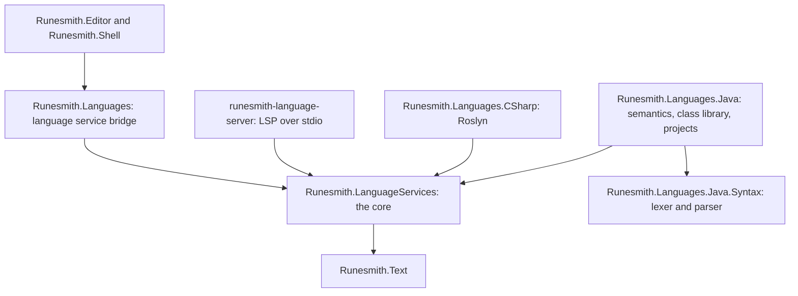

# Language services

Runesmith understands code through its own language services: one shared core that keeps documents, schedules work and serves editor
requests, and one analyzer per language. This document describes the core in detail, the C# and Java analyzers built on it, the
performance goals they are held to, and how they are tested and measured.

It replaces the use of an external C# language server. Measured on the Runesmith solution, that server answered every completion request
with about 1,000 unfiltered suggestions (177 KB of JSON), marked every list as incomplete so the editor asked again on every key press, and
sent everything through JSON and a process boundary. See [Instant editing](instant-editing.md) for those measurements.

## Principles

1. **The editor never waits.** Typing, drawing and moving the caret never block on analysis. Analysis answers asynchronously, and an answer
   for an older version of the text is still useful when it is moved through the edits made since.
2. **Interactive requests come first.** Completion and signature help preempt hover and navigation, which preempt diagnostics and
   indexing. Work for an older version of a document is cancelled when a newer one arrives, unless it is close to done and still useful.
3. **Share, do not copy.** In the editor's process, a language service reads the editor's own immutable text snapshots. No text is
   serialized, and an edit is passed as the changes it made.
4. **Do the minimum, filter at the source.** A completion request returns the suggestions that match what is typed, ranked, capped, and
   with their details left for when they are shown.
5. **Measure everything.** Every request records its latency per stage, so a regression shows up in the performance report and in the
   benchmarks before a user feels it.

## Architecture

| Project | Responsibility | Dependencies |
| --- | --- | --- |
| `Runesmith.LanguageServices` | The core: documents, workspaces, the scheduler, the request pipeline, completion ranking, caches, metrics | `Runesmith.Text` only |
| `Runesmith.Languages.CSharp` | The C# analyzer | The core, Roslyn (`Microsoft.CodeAnalysis.CSharp.Features`, `Microsoft.CodeAnalysis.Workspaces.MSBuild`) |
| `Runesmith.Languages.Java.Syntax` | Java's lexer, parser and syntax tree, for every Java version | none |
| `Runesmith.Languages.Java` | The Java analyzer: semantics, the JDK and library class reader, Maven and Gradle projects | The core, the Java syntax |
| `Runesmith.LanguageServer` | An executable that serves any analyzer over the Language Server Protocol, for isolation and for other tools | The core, `Runesmith.Lsp`, the analyzers |

Each passes the [project checklist](../../website/content/developers/projects.mdx): the core carries no compiler; Roslyn stays out of
everything but the C# analyzer; the Java syntax has no dependencies and is tested and benchmarked on its own.

The plugins `Runesmith.CSharp` and `Runesmith.Java` export the language definitions, the analyzers and the build providers. The C# plugin
no longer starts an external server.

### In process or out of process

The editor runs analyzers in its own process by default: that is the only way to share text snapshots and to answer in microseconds what
a separate process answers in milliseconds. The same analyzers also run in `runesmith-language-server`, which speaks the Language Server
Protocol over stdio, so other tools can use Runesmith's analyzers. The editor does not run its own analyzers out of process: profiling the
typing benchmark showed that the costs that remained were the JIT and the compiler's own work, not garbage collection pauses a separate
process would keep away from the UI thread (see Results).

## The core

### Documents and versions

A `SourceDocument` is a path, a language, a version number and a `TextSnapshot` from `Runesmith.Text`. Snapshots are immutable and share
structure, so keeping the last few versions costs little and reading them from any thread is safe.

- **Open, change, close.** The bridge tells the core when the editor opens, changes or closes a document. A change passes the new snapshot
  and the `TextChange` list that made it, so an analyzer can update incrementally (Roslyn's `SourceText.WithChanges`, Java's partial
  reparse) instead of starting from the text.
- **Version mapping.** Every request carries the version it was made for. The core keeps the change lists between recent versions, so a
  result computed for version 7 can be moved to version 9: a span through the changes, an offset with the same rules as the editor's
  `OffsetMapping`.
- **Files that are not open** belong to the analyzers' own project models, which read them from disk; only open documents pass through the
  core.

### Workspaces

The core has no project model of its own. It passes the opened folder to each analyzer, which finds and loads the projects it understands
(`.slnx`, `.sln` and `.csproj` for C#; `pom.xml`, `build.gradle`, `build.gradle.kts` and `settings.gradle` for Java) in the background lane.
A file that belongs to no project gets a default project: the newest language version and the default class library.

### The scheduler

All analyzer work runs through the host's scheduler, with three lanes:

| Lane | Requests | Rule |
| --- | --- | --- |
| Interactive | completion, completion details, signature help | Runs at once on the thread pool; never queued behind other lanes. |
| Navigation | hover, go to definition, code actions, rename, formatting | Runs when no interactive request is waiting. |
| Background | diagnostics, inlay hints, project loading, warming up, work ahead of the user | Runs when the other lanes are idle; pauses at its next `YieldAsync` when an interactive request arrives. Work that cannot pause, such as one long compiler call to find problems, is cancelled through a preemption token and runs again when typing pauses. |

- **Cancellation.** The editor cancels its previous request of a kind when it asks again, and an analyzer's work ahead of the user is
  cancelled by the next edit. Diagnostics are debounced: they start 150 ms after the last change, and restart if another change comes.
- **Deadlines.** Each request kind has a budget (below). A request past its budget still finishes, but is recorded, so slow paths show up
  in the report.
- **Threads.** Interactive work never runs on the UI thread. The bridge awaits results without blocking it.

### Requests

The analyzer interface is small, and every method is asynchronous, cancellable and versioned:

| Request | Returns |
| --- | --- |
| `CompleteAsync(document, version, offset, trigger)` | A ranked, filtered, capped completion list |
| `ResolveAsync(item)` | The item's documentation and the extra edits accepting it makes, such as adding a `using` or `import` |
| `HoverAsync(document, version, offset)` | Markdown and the span it describes |
| `DefinitionAsync(document, version, offset)` | Locations in files |
| `SignatureHelpAsync(document, version, offset)` | Signatures, the active one and the active parameter |
| `DiagnosticsAsync(document, version)` | Problems, pushed to the editor through a channel as each document finishes |
| `CodeActionsAsync(document, version, span)`, `ResolveCodeActionAsync(entry)` | Quick fixes and, when asked, refactorings; then their edits by line and column (`ICodeActionAnalyzer`) |
| `PrepareRenameAsync(document, version, offset)`, `RenameAsync(...)` | The name to rename, then the edits in every file (`IRenameAnalyzer`) |
| `FormatAsync(document, version, span)` | The changes that format the document or a span (`IFormattingAnalyzer`) |
| `InlayHintsAsync(document, version)` | Parameter names and inferred types drawn inside lines, in the background lane (`IInlayHintAnalyzer`) |

An analyzer implements what it can; the core answers the rest with nothing.

### Completion

Completion is where the editor is most sensitive, so the pipeline does the expensive work once per word and the cheap work per key press:

1. **Context.** The analyzer finds what is being completed (a member after `.`, a name in a statement, a type after `new`, a keyword) and
   the span of the word being typed.
2. **Candidates.** It produces candidates into a `CompletionSink` as it finds them, cheapest sources first: locals and parameters, then
   members of the containing type, then imported types and members, then everything else. Each candidate is a compact struct: a label,
   a kind, a sort group, a symbol handle for details, and nothing else.
3. **Filter and rank at the source.** The sink matches each candidate against the typed word with the shared `CompletionMatcher` (the same
   one the editor uses): a 64-bit character mask rejects most candidates with one AND, the rest are scored without allocating. Ranking is
   the match score, then the analyzer's sort group (locals before members before types before keywords), then how recently the user
   accepted the same label, then the label.
4. **Cap.** The list is cut at 300 items. Only a cut list is marked incomplete; a complete list lets the editor filter everything after it
   without asking again.
5. **Details later.** Documentation, full signatures and extra edits are computed in `ResolveAsync`, only for the item the user selects.

When the editor asks again for the same word (because it was cut), the analyzer reuses the candidates of the last request for the same
document position and context, and only filters again.

### Caches

- **Per document version**: the syntax tree, the semantic model where an analyzer has one, and the last completion candidates.
- **Per workspace**: the symbol index (type names and their locations, for completing types that are not imported yet and for going to
  definitions in other files), built in the background and updated per changed file.
- **On disk**: the Java class library index per JDK release, and per library JAR, keyed by the file's path, size and time, in
  `RunesmithPaths.Cache`, so a second start reads instead of reading class files.

### Metrics

Each request records its stages under the meter `Runesmith.LanguageServices`: `queue`, `analyze`, `candidates`, `filter`, `total`, tagged
with the language and the request kind, plus the number of candidates and of items returned. The editor's performance report shows them
next to the editor's own measurements.

## C#

The C# analyzer is built on Roslyn, the C# compiler, used as a library. It supports every C# version Roslyn does, from C# 1 to the
newest (C# 14 with Roslyn 5.9), chosen per project from its `LangVersion`.

- **Loading.** `MSBuildWorkspace`, whose build host finds the installed .NET SDK, opens the folder's solution (`.slnx` or `.sln`) or its
  projects, in the background. The compiler's services are composed on a background thread too, since that takes about half a second. Until a project is loaded, its files get a default project with the newest language version and the
  runtime's reference assemblies, so completion works from the first second, without project references.
- **Edits.** A change is applied with `SourceText.WithChanges` and `Solution.WithDocumentText`, so Roslyn reparses incrementally and keeps
  everything it can.
- **Completion.** Roslyn's `CompletionService` produces the candidates. The analyzer turns them into the core's compact items, filters,
  ranks and caps them, and keeps Roslyn's items for `ResolveAsync`, which uses `GetDescriptionAsync` for documentation and `GetChangeAsync`
  for extra edits such as adding a `using`. Types from namespaces that are not imported yet are not suggested in this version.
- **Hover** uses the symbol at the position and its documentation comment, formatted as Markdown.
- **Definitions** come from `SymbolFinder`; a symbol from a library without source has no location in this version.
- **Signature help** finds the invocation or object creation around the offset, its candidate methods from the semantic model, and the
  active parameter from the argument list.
- **Diagnostics** are the compiler's for the document, in the background lane, without analyzers.
- **Warming up.** At start, a scratch document runs the completion pipeline once, so the JIT has compiled it. After loading, the analyzer
  completes and describes once inside a method body of each open document, and types a few characters on a copy, so the first real
  requests find the compiler's caches filled.
- **Work ahead of the user.** After a separator, the list for the next word is computed before its first letter. While an identifier is
  typed, the member list after a `.` that may follow is computed on a copy with the dot, and used if the next edit types exactly that dot.
  This costs processor time on every key, and measurements showed that it is also what keeps completion requests fast, so it stays.

## Java

The Java analyzer is Runesmith's own, written in C#. It needs no JVM and no external server, and it supports every Java version from 8 to
25, chosen per project.

### Versions

The parser accepts the syntax of every version, and the analyzer reports a feature the project's version does not have, as `javac
--release` does: "Records need Java 16 or later". The table drives both the diagnostics and which keywords completion offers.

| Feature | Since |
| --- | --- |
| Lambdas, method references, default methods | 8 |
| Modules (`module-info.java`) | 9 |
| `var` for local variables | 10 |
| `var` in lambda parameters | 11 |
| Switch expressions and `yield` | 14 |
| Text blocks | 15 |
| Records, pattern matching for `instanceof` | 16 |
| Sealed classes (`sealed`, `non-sealed`, `permits`) | 17 |
| Pattern matching for `switch`, record patterns | 21 |
| Unnamed variables and patterns (`_`) | 22 |
| Markdown documentation comments (`///`) | 23 |
| Module import declarations, compact source files and instance `main` methods, flexible constructor bodies | 25 |

Preview features of the newest version, such as primitive types in patterns, parse too, and are reported unless the project enables
preview features.

### Syntax

- **Lexer.** All of Java's tokens: Unicode escapes, every number form with underscores, char and string literals, text blocks with their
  indentation rules, comments (and documentation comments of both kinds), and the contextual keywords (`var`, `record`, `sealed`,
  `permits`, `yield`, `module`, `open`, `requires` and the others) as identifiers the parser interprets by position.
- **Parser.** A hand-written recursive descent parser with precedence climbing for expressions. It produces an immutable tree in which
  every node has its span, and keeps going after errors: a missing token is inserted, an unexpected one skipped, and statements and
  members resynchronize at `;`, `}` and the next member's start, so a half-typed line never hides the rest of the file.
- **Incremental reparsing.** After an edit, only the smallest enclosing member body (a method, constructor or initializer block) is
  reparsed when the edit stays inside it and its braces still balance; otherwise the whole file is.
- **Correctness.** Every source file of the JDK's own `src.zip` parses with no errors.

### The class library

- **The JDK.** The analyzer finds JDKs through `JAVA_HOME`, `java` on the `PATH`, and the usual install folders on each system. Its API for
  a given release comes from the JDK's `lib/ct.sym`, which holds the public API of every release from 8 to the JDK's own as class files, so
  a project targeting Java 11 is offered exactly Java 11's API, even with a newer JDK installed.
- **Class files.** A class file reader reads the constant pool, classes, fields, methods, generic signatures, inner classes and records
  and permitted subclasses, into compact symbols. It reads only what completion and resolution need, and only when first asked.
- **Libraries.** JARs referenced by the project, from the local Maven repository and the Gradle cache, are read the same way, and indexed
  once per file.

### Projects

- **Maven**: `pom.xml` with its parent chain for the source folders, `maven.compiler.release` (or `source`), preview flags and
  dependencies, resolved against `~/.m2/repository`, transitively through their POMs.
- **Gradle**: `build.gradle` and `build.gradle.kts`, read for the Java toolchain or `sourceCompatibility`, source sets and dependencies,
  found in the Gradle cache. The build scripts are read, not run.
- **Plain folders**: every `.java` file under the folder, with the newest Java version and the JDK's API.

### Semantics

- **Scopes and names**: packages, imports (single type, on demand, static, and module imports), nested and local types, members inherited
  from supertypes and interfaces, locals and parameters, with Java's shadowing rules.
- **Types**: declared types with generics; `var` inferred from its initializer; expression types for literals, `new`, field and method
  access (with type arguments substituted), calls of overloaded methods chosen by argument count and types, casts, conditional and switch
  expressions, and lambda parameters from the target functional interface where the target is known.
- **Diagnostics** are reported only where the analyzer is certain: syntax errors, features newer than the project's version, imports of
  types that do not exist, names that resolve to nothing in a fully understood scope. Anything it cannot fully resolve, it leaves alone
  rather than guess, so it never shows a problem that the compiler would not.

### Features

- **Completion**: keywords valid at the position and version, locals, parameters, fields and methods in scope, members after `.` (including
  static members of types and inherited members), types for declarations and `new`, packages and types in imports, and types that are not
  imported yet with the `import` added on accept.
- **Hover**: a symbol's signature and its documentation comment, from source or, for the JDK, the API's signature.
- **Go to definition**: declarations in the project's sources.
- **Signature help**: overloads of the called method or constructor and the active parameter.

## Performance goals

The goals hold on the reference machine (a mini PC with NixOS) in the Release build, and the benchmarks check them.

### C#

| Measurement | Target |
| --- | --- |
| Completion, warm, Runesmith solution, member access and statement starts | p95 under 40 ms, of which the core's share under 2 ms |
| Completion, the same word asked again | p95 under 5 ms |
| First completion after the solution loaded | under 300 ms |
| Hover and signature help, warm | p95 under 30 ms |
| Diagnostics of an open document after an edit | under 300 ms after the 150 ms pause |

### Java

| Measurement | Target |
| --- | --- |
| Lexing | over 100 MB/s |
| Parsing a 10,000-line file from scratch | under 20 ms |
| Reparsing after typing inside a method | under 1 ms |
| Completion, member access and statement starts | p95 under 10 ms |
| Loading the JDK API for a release, first time and from the cache | under 500 ms and under 50 ms |
| Diagnostics of a 2,000-line file | under 30 ms |
| Every file of the JDK's `src.zip` | parses with no errors |

### The editor with the analyzers

| Measurement | Target |
| --- | --- |
| `completion.shown` from an analyzer, C# | p95 under 50 ms |
| `completion.shown` from an analyzer, Java | p95 under 25 ms |
| `input_to_render` while analyzers work | p95 under 4 ms |

## Testing and benchmarks

- **Unit tests** for each project, with xUnit v3: the core's version mapping, scheduler and completion ranking; Java's lexer and parser for
  every feature of every version, error recovery and incremental reparsing; the class file reader against real `ct.sym` and JARs; Java
  semantics on small projects; C# on small temporary projects for each request.
- **Conformance**: parse every file of a JDK's `src.zip`; complete at every member access in a corpus of Java and C# files and check the
  expected member is in the list.
- **Benchmarks** with BenchmarkDotNet in `benchmarks/Runesmith.Benchmarks`: lexing and parsing, reparsing, completion for both languages,
  JDK loading cold and cached, and the core's ranking.
- **End to end**: the editor benchmark session from [Instant editing](instant-editing.md), on a C# and a Java project, compared against the
  targets above.

## Delivery

1. The core, with the in-process bridge, the scheduler and the metrics.
2. The C# analyzer, replacing the external server in the C# plugin.
3. The Java syntax, with the `src.zip` conformance test.
4. The Java class library, projects and semantics, and the Java plugin.
5. The LSP host executable.
6. The editor's completion engine from [Instant editing](instant-editing.md), on top of the analyzers.

Each step is tested and benchmarked before the next, and the results are added to this document.

## Results

Measured on the reference machine in the Release build. The analyzers' own numbers come from BenchmarkDotNet and the tests; the editor's
from the typing benchmark (`benchmarks/Runesmith.TypingBenchmark`), which types sixteen lines into a method at about 140 words a minute
once the folder's projects are loaded, and reports the median over five runs of each percentile.

### C#

On the Runesmith solution (31 projects):

| Measurement | Result | Target | Met |
| --- | --- | --- | --- |
| Completion at a word start, measured directly | p95 5.0 ms | p95 under 40 ms | Yes |
| Completion after a dot, measured directly | p95 13.4 ms | p95 under 40 ms | Yes |
| Completion requests while typing in the editor | p95 29.7 ms | p95 under 40 ms | Yes |
| The core's share of a request (queue and ranking) | p95 1.3 ms | under 2 ms | Yes |
| The same word asked again | p95 2.6 ms | p95 under 5 ms | Yes |
| First completion after the solution loaded | 142 ms | under 300 ms | Yes |
| Signature help while typing | p95 16.3 ms | p95 under 30 ms | Yes |
| Hover while typing | p95 36.8 ms | p95 under 30 ms | No |
| Diagnostics of an open document after an edit | p95 52.5 ms | under 300 ms | Yes |

### Java

The analyzer's benchmarks run on a generated project of 150 classes; the editor's numbers come from typing into
`java.util.stream.Collectors` in a Maven project made of the JDK's own `java.util` sources.

| Measurement | Result | Target | Met |
| --- | --- | --- | --- |
| Lexing | 228 to 322 MB/s | over 100 MB/s | Yes |
| Parsing a 10,000-line file from scratch | 7.4 to 15.1 ms | under 20 ms | Yes |
| Reparsing after typing inside a method | 0.1 to 0.6 ms | under 1 ms | Yes |
| Completion, measured directly | p95 0.1 ms | p95 under 10 ms | Yes |
| Completion requests while typing in the editor | p95 11.7 ms | p95 under 10 ms | No |
| Loading the JDK API, first time and from the cache | 35 ms and 3.9 ms | under 500 ms and under 50 ms | Yes |
| Diagnostics of a 2,000-line file | 13.6 ms | under 30 ms | Yes |
| Every file of the JDK's `src.zip` | 15,227 files, no errors | no errors | Yes |
| Semantic problems reported in 490 correct JDK files | none | none | Yes |

### The editor with the analyzers

| Measurement | C# | Java | Target | Met |
| --- | --- | --- | --- | --- |
| `completion.shown` p95 | 38.2 ms | 27.6 ms | C# under 50 ms, Java under 25 ms | C# yes, Java no |
| `edit` p95 | 0.8 ms | 0.4 ms | under 2 ms | Yes |
| `input_to_render` p95 | 6.8 ms | 7.4 ms | under 4 ms | No, see below |
| `ui.stall` p95 | 0.9 ms | 0.5 ms | | |

`input_to_render` stays within one frame, which is the goal [Instant editing](instant-editing.md) settled on after measuring that the
rest is waiting for the display's next frame; the 4 ms target above predates that finding.

### What the measurements changed

- **The JIT was the largest cost.** A profile of the typing session showed the runtime recompiling the compiler's code on one core the
  whole time. Turning off profile-guided recompilation halved the processor time and the C# requests' p95; precompiling with ReadyToRun
  made no measurable difference and was left out.
- **Work ahead of the user pays for itself.** Computing the member list after every identifier character looks wasteful, but limiting
  it to names with members made completion requests slower (13 ms to 22 ms at p95), because the speculation also kept the compiler's
  model of the method current.
- **Garbage collection was not the problem.** Full collections came from the software renderer allocating a framebuffer per frame, which
  a retained framebuffer removed (69 full collections per session to 3); with that, collections pause the process for under 1 ms per
  second of typing, so the analyzers stay in the editor's process.
- **Composing the compiler's services took 520 ms on the UI thread** at startup, and now happens in the background.

### Not met yet

- **Java completion in a large project** (11.7 ms, against 0.1 ms on the generated project): the requests in `java.util` spend their
  time on scopes and imports of a large source set; caching them per file version is the next step.
- **C# hover** (36.8 ms): the compiler's description service is slower than the completion path; a cache of descriptions per symbol is
  the next step.
