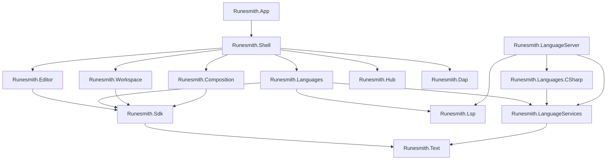

Runesmith is split into projects by responsibility and by dependency: the projects at the bottom have no user interface and no heavy
dependencies, and each layer above adds one. [Projects and when to add one](./projects.mdx) has the rules and the checklist for adding a
project.

## The projects

| Project | What it holds |
| --- | --- |
| `src/Runesmith.Text` | The text buffer: a persistent piece tree with immutable snapshots, line lookup, changes, undo history, search and word boundaries. No dependencies. |
| `src/Runesmith.Lsp` | A Language Server Protocol client: JSON-RPC over a server's standard input and output, the protocol types and the server's lifecycle. Only `System.Text.Json`. |
| `src/Runesmith.Dap` | A Debug Adapter Protocol client: requests, responses and events over a debug adapter's standard streams or a socket, and the protocol types. Only `System.Text.Json`. |
| `src/Runesmith.Sdk` | The plugin API: the contracts plugins export and the services they import. Published as a package for plugins. |
| `src/Runesmith.Composition` | Finds and checks plugins, loads each in its own load context and composes everything with VS-MEF, with a cache. |
| `src/Runesmith.Hub` | The plugin hub client: the verified index, search, install plans, installs and updates, and what the hub's states mean for installed plugins. No user interface. |
| `src/Runesmith.Workspace` | The open folder, its file index and watcher, the Explorer's tree, documents on disk, settings, Quick Open and find in files. |
| `src/Runesmith.LanguageServices` | The language services core: open documents and their versions, the request scheduler, the completion sink and ranking, and metrics. Only `Runesmith.Text`. See [Language services](./language-services.mdx). |
| `src/Runesmith.Languages.CSharp` | The C# analyzer, on the C# compiler (Roslyn): completion, hover, go to definition, signature help and problems. |
| `src/Runesmith.LanguageServer` | `runesmith-language-server`, which serves the same analyzers over the Language Server Protocol. |
| `src/Runesmith.Languages` | The language registry, TextMate highlighting, problems, merged language features, the bridge that runs analyzers in Runesmith's process and the bridge to language servers. |
| `src/Runesmith.Editor` | The editor control: drawing, input, editing operations, completion, signature help, hover and the find bar. |
| `src/Runesmith.Shell` | The window: menus, commands and key bindings, docking, panels, pages, the command palette, sessions and builds. |
| `src/Runesmith.App` | The executable: the command line, one running instance, crash logs and startup. |
| `tools/Runesmith.BundledPlugins` | Fetches the plugins `bundled-plugins.json` pins from the plugin hub during the app's build, checks them against the signed index and unpacks them into `plugins/<id>`. See [Bundled plugins](./building.mdx#bundled-plugins). |
| `templates/Runesmith.Templates` | The `dotnet new runesmith-plugin` template. |

`tests/` has a test project for each project in `src/` except the SDK and the app, and `benchmarks/Runesmith.Benchmarks` holds the
benchmarks.

## Startup

<Steps>

1. `Program.Main` reads the command line. When Runesmith runs already, it hands the paths or link to that instance and exits.
2. `HubStartup` puts installs from the plugin hub into effect, moves plugins the hub blocked to quarantine and checks the files of the
   others, and says which plugins must not load.
3. It starts the composition on a background thread while Avalonia starts. The composition finds the plugins, loads them and composes them
   with the parts of Runesmith's own assemblies, from the cache when nothing changed. See [Composition and plugins](./composition.mdx).
4. `ShellStartup.CreateMainWindow` applies the theme and creates the main window from the composed parts.
5. Once the window shows, `ShellStartup.OnShownAsync` starts the language server bridge and the analyzer bridge, reports plugins that
   failed, calls each `IPlugin.InitializeAsync`, opens what the command line names, or the last folder, and checks the plugin hub.

</Steps>

## From a key to an edit

A key press goes to the focused element first. The editor's `TextArea` handles editing keys itself, such as arrows, <Keys>Backspace</Keys>
and <Keys>Ctrl+Z</Keys>, and turns them into `EditOperations`: pure functions from a snapshot and a selection to a list of changes and the
selection after them. The area applies the changes to the document's `TextBuffer`, which creates a new snapshot, and records the step in
the document's `UndoHistory`.

The buffer's `Changed` event then reaches everyone who follows the document: the highlighter retokenizes from the first changed line, the
analyzer bridge passes the new snapshot and its changes to the language's analyzer, the language server bridge sends the changes to a
language server, and the editor redraws the lines that changed. Keys the editor does not handle bubble to the window, which looks them up
in the `CommandService` and runs the bound command.

## Threads

The user interface runs on Avalonia's UI thread. Snapshots are immutable, so the highlighter, the search, the analyzers and the language
server bridge read them on background threads while you type. Services raise their events on the UI thread unless their documentation
says otherwise.

## Language support

Language features come from two places. Language analyzers, such as the C# analyzer, run in Runesmith's process through
`AnalyzerBridge` and the language services core; [Language services](./language-services.mdx) describes them. Language servers that
plugins declare with `LanguageServerDefinition` run as child processes, and `Runesmith.Languages` talks to them through `Runesmith.Lsp`.

## Related

- [Projects and when to add one](./projects.mdx)
- [Composition and plugins](./composition.mdx)
- [Language services](./language-services.mdx)
