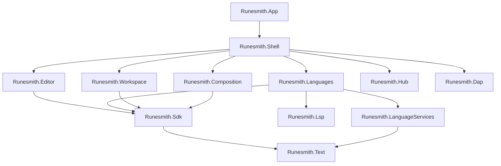

Runesmith is split into C# projects so that each part has one job, carries only the dependencies that job needs, and can be built and tested
on its own. A project is not free, though: it adds a build step, a test project, a place to look for code and a seam that has to stay
stable. This page says when a new project is worth that cost.

## The checklist

Add a project under `src/` only when **every** item holds. If one does not, put the code in the existing project it belongs to.

- [ ] **One responsibility you can name in a few words**, such as "the text buffer" or "the language server client", and no existing project
  already has it.
- [ ] **A clean place in the dependency graph.** It depends only on projects below it, nothing below it would need to depend on it, and the
  split creates no cycle.
- [ ] **A dependency reason.** It carries a dependency that other projects must not carry, such as Avalonia, VS-MEF or TextMateSharp, or
  other projects must be able to use it without carrying its dependencies.
- [ ] **A small public surface.** Callers use it through a handful of public types, and its internals can change without touching them.
- [ ] **It works on its own.** It can be built, tested and benchmarked without the shell, for example headless or without a window.
- [ ] **Real code today.** It holds several types of code that exists now or is part of the current plan, not a single class and not code
  that might come one day.
- [ ] **Not a dumping ground.** It is not a `Common`, `Utilities` or `Helpers` project. Shared code goes into the lowest project that needs
  it.
- [ ] **Its costs are paid.** It gets a test project in `tests/`, a row on this page and on the [architecture](./architecture.mdx) page.

These are signs that code should stay where it is:

- It has one caller.
- It always changes together with another project.
- Splitting it out would need many `internal` members to become `public`.

The official plugins, such as Git, GitHub, C# and Java, are not projects in this repository, and neither is their code, such as the C#
and Java analyzers. Each lives in its own repository in the [RunesmithHub](https://github.com/RunesmithHub) organization, builds against
the published packages, and reaches Runesmith through the plugin hub like a third-party plugin, which proves that pipeline works.
Runesmith ships with no plugins. See [Official plugins](./building.mdx#official-plugins).

## The projects

| Project | Responsibility | Why it is its own project |
| --- | --- | --- |
| `Runesmith.Text` | The text buffer: a piece table with immutable snapshots, line lookup, edits, undo history and text search | Every other part uses it; it has no dependencies at all, so it can be tested and benchmarked in isolation. |
| `Runesmith.Lsp` | A Language Server Protocol client: JSON-RPC over streams, the protocol types and a server's lifecycle | It knows nothing about Runesmith, so it stays reusable and testable against any server; only `System.Text.Json`. |
| `Runesmith.Dap` | A Debug Adapter Protocol client: the base protocol over streams, the protocol types and a debug adapter's process | It knows nothing about Runesmith, so it can be tested against any adapter, and only the shell carries it; only `System.Text.Json`. |
| `Runesmith.Sdk` | The plugin API: plugin lifecycle, the service contracts plugins use and the extension points they export | Plugins reference only this project. It must stay small and stable, and must not carry the shell, VS-MEF or TextMate. |
| `Runesmith.Composition` | Finding, validating and loading plugins, and composing them with VS-MEF, including the composition cache | The only project that depends on VS-MEF. It runs headless, so plugin loading can be tested without a window. |
| `Runesmith.Hub` | The plugin hub client: the verified index, search, install plans, installs, updates and the hub's states for installed plugins | It decides what plugins run, so it is built into the host, and it runs headless: the app uses it before any window exists, and its tests run against a signed sample index. The only project besides the composition that uses `RunesmithHub.Protocol`. |
| `Runesmith.Workspace` | Folders, solutions, the file tree and watcher, the file index for quick open, documents on disk and find in files | Pure file system and text work with no UI dependency, testable headless. |
| `Runesmith.LanguageServices` | The core of the language analyzers: documents and their versions, request lanes, completion ranking and metrics | Shared by the editor and the language plugins, which build on its package, so it depends on neither; only `Runesmith.Text`. |
| `Runesmith.Languages` | The language registry, TextMate highlighting, and the bridges that turn language servers and in-process analyzers into editor features | The only project that carries TextMateSharp and that uses `Runesmith.Lsp`. |
| `Runesmith.Editor` | The text editor control: layout, rendering, input, completion, hover, diagnostics and the find bar | The largest UI component. It depends on the SDK contracts only, not on TextMate or language servers, so it can be developed and tested on its own. |
| `Runesmith.Shell` | The IDE window: docking, commands, menus, the command palette, settings, the status bar and the tool windows | It wires everything together; nothing depends on it except the application. |
| `Runesmith.App` | The executable: the command line, the single running instance and the desktop platform | Keeps the desktop backend out of the shell, so the shell can run headless. |

Each project has a matching project in `tests/`. `benchmarks/Runesmith.Benchmarks` holds the benchmarks, and
`benchmarks/Runesmith.TypingBenchmark` the typing benchmark.
